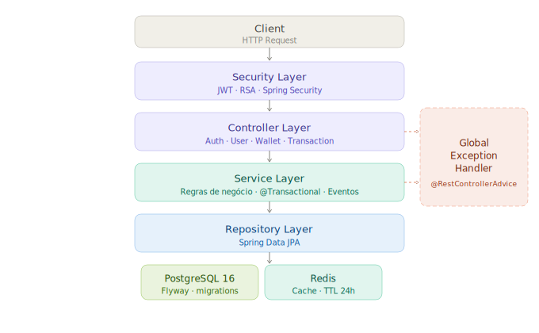
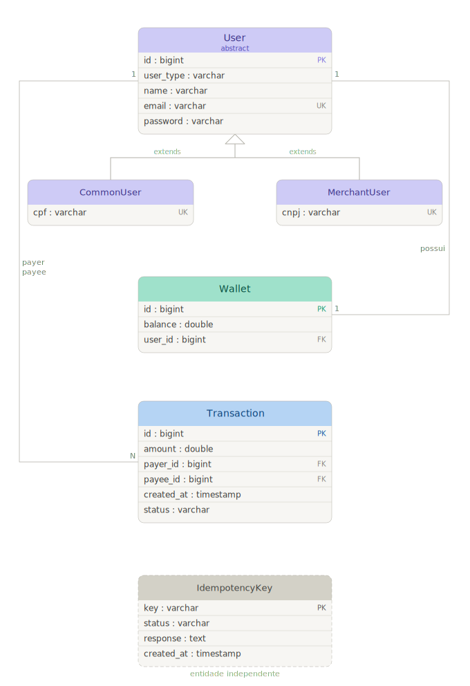
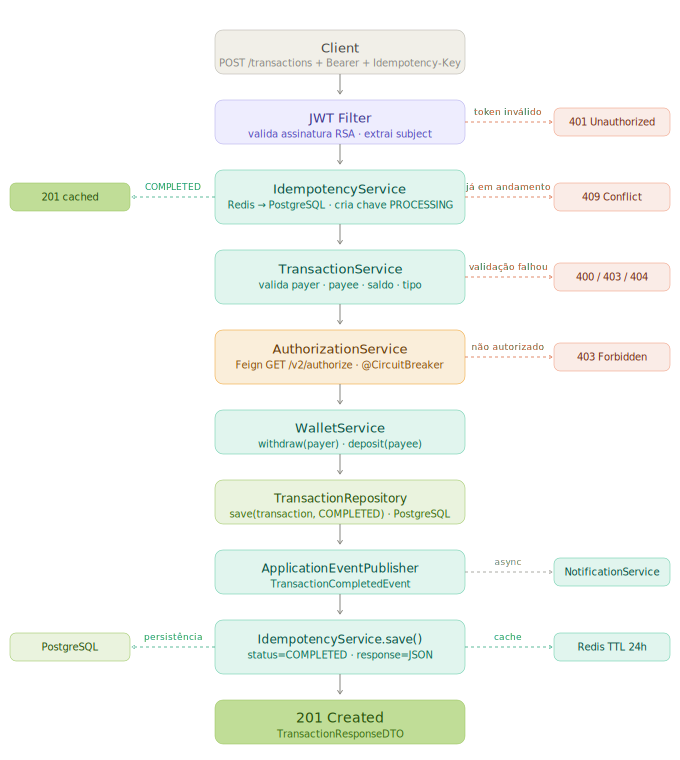
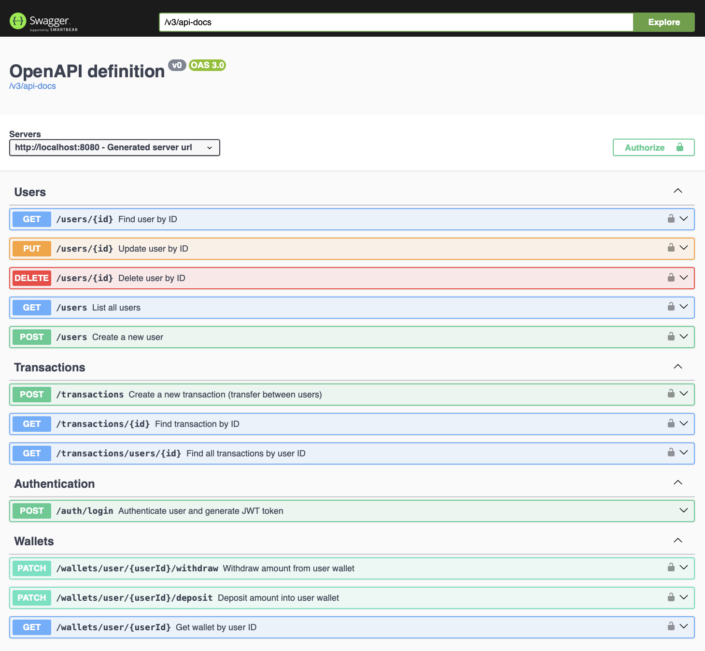
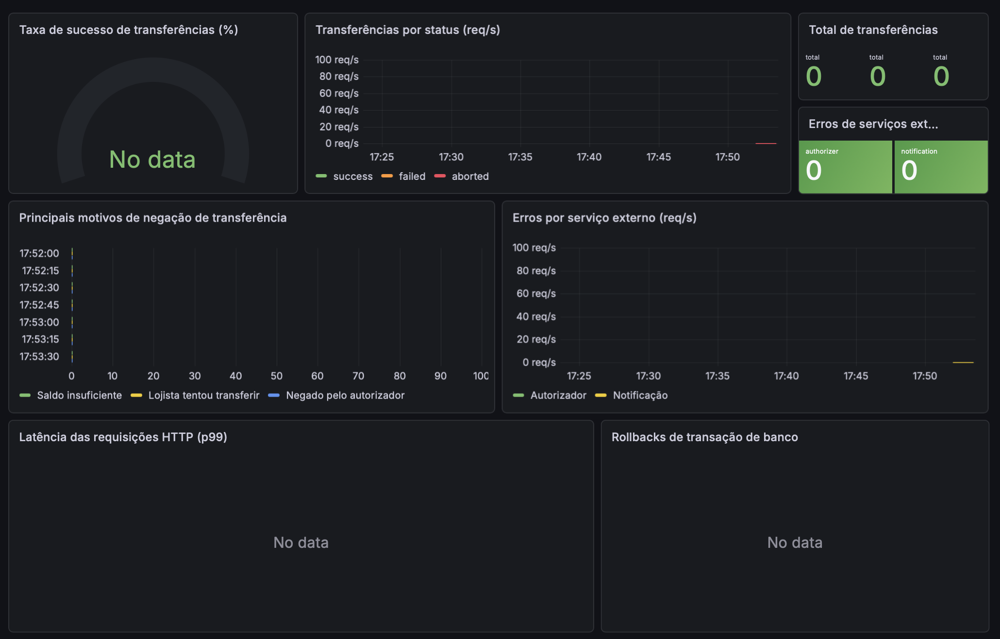

# PicPay Simplificado

          

Implementação do [desafio técnico do PicPay](https://github.com/PicPay/picpay-desafio-backend) focado em transferências financeiras entre usuários e lojistas.

## Tecnologias
* **Linguagem:** Java 21.
* **Framework:** Spring Boot 3.4.
* **Persistência:** PostgreSQL 16 & Flyway.
* **Cache & Idempotência:** Redis.
* **Segurança:** Spring Security, JWT (RSA) & BCrypt.
* **Resiliência:** Resilience4j (Circuit Breaker) & Feign.
* **Observabilidade:** Prometheus & Grafana.
* **Testes:** JUnit 5, Mockito, Testcontainers & Pitest (Mutação).

## Arquitetura
O sistema utiliza uma arquitetura em camadas com responsabilidades bem definidas.

<div align="center">
  
</div>

<div align="center">
  
</div>


## Fluxo de Transferência
O processo inclui validação de perfil (lojistas apenas recebem), verificação de saldo e garantia de execução única via chave de idempotência.

<div align="center">
  
</div>

## Endpoints Principais
A documentação interativa completa (Swagger) fica disponível em `/swagger-ui/index.html`.

<div align="center">
  
</div>

## Observabilidade
Monitoramento em tempo real via Grafana e métricas exportadas pelo Actuator.

<div align="center">
  
</div>

## Como Executar
Requer **Docker** e **Docker Compose**.

```bash
# Clone o repositório
git clone [https://github.com/edrassimoes/picpay-simplificado.git](https://github.com/edrassimoes/picpay-simplificado.git)

# Suba o ambiente completo
docker compose up --build
```
A aplicação estará disponível em http://localhost:8080.
